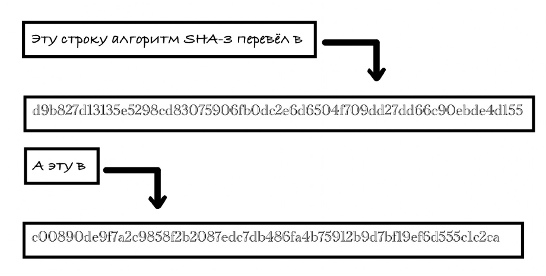

---
## Front matter
lang: ru-RU
title: "Доклад на тему 'Хэш-функции'"
subtitle: 
author:
  - Явкина Анастасия Юрьевна
institute:
  - Российский университет дружбы народов им. Патриса Лумумбы, Москва, Россия
## Front matter
lang: ru-RU
title: "Доклад на тему 'Хэш-функции'"
subtitle: 
author:
  - Явкина Анастасия Юрьевна
institute:
  - Российский университет дружбы народов им. Патриса Лумумбы, Москва, Россия
date: 12 октябры 2024

babel-lang: russian
babel-otherlangs: english
mainfont: Arial
monofont: Courier New
fontsize: 12pt

## Formatting pdf
toc: false
toc-title: Содержание
slide_level: 2
aspectratio: 169
section-titles: true
theme: metropolis
header-includes:
 - \metroset{progressbar=frametitle,sectionpage=progressbar,numbering=fraction}
 - '\makeatletter'
 - '\beamer@ignorenonframefalse'
 - '\makeatother'
---

# Содержание

1. Хэш-функции.
2. Применение хэш-функций.
3. Свойства криптографических хеш-функций.
4. Принцип работы хэш-функции.
5. Безопасность криптографической хеш-функции.
6. Пример
7. Заключение
8. Список литературы

# Докладчик

* Явкина Анастасия Юрьевна
* студент 4-го курса НПМбд-02-21
* Российский университет дружбы народов им. Патриса Лумумбы
* 1032216503@pfur.ru
* https://github.com/ayyavkina/-

# Цель

Целью данного доклада является объяснить основные концепции, принципы работы и применения хэш-функций в информатике, а также подчеркнуть их важность для обеспечения безопасности данных и оптимизации вычислительных процессов.

# Глава 1. Хэш-функции.

{#fig:001 width=70%}

# Глава 1.1 Применение хэш-функций.

Основное назначение хеширования — проверка информации. Эта задача важна в огромном количестве случаев: от проверки паролей на сайте до сложных вычислений в блокчейне. Так как хеш — это уникальный код определенного набора данных, по нему можно понять, соответствует ли информация ожидаемой. Поэтому программа может хранить хеши вместо образца данных для сравнения. Это может быть нужно для защиты чувствительных сведений или экономии места.\
Вот несколько примеров:\
•	вместо паролей на сервере хранятся хеши паролей;\
•	антивирус хранит в базе хеши вирусов, а не образцы самих программ;\
•	электронная подпись использует хеш для верификации;\
•	информация о транзакциях криптовалюты хранится в виде кешей;\
•	коммиты в Git идентифицируются по хешу

# Глава 2. Свойства хеш-функций.

1. **Необратимость.** 
2. **Детерминированность.** 
3. **Уникальность.** 
4. **Разнообразие.** 
5. **Высокая скорость генерации.** 

# Глава 3. Принцип работы хэш-функции.

Возможных преобразований для получения хеша бесконечное количество. Это могут быть формулы на основе умножения, деления и других операций, алгоритмы разного уровня сложности. \
\
Но если хеш применяется для защиты данных, его функция должна быть криптографической — такие хеш-функции обладают определенными свойствами. Именно криптографические хеш-функции используются, например, при хранении паролей.\
\
Если говорить о криптографической хеш-функции, то она чаще всего работает в несколько шагов. Данные разбиваются на части и проходят через сжимающую функцию, которая преобразовывает информацию в меньшее количество бит. Функция должна быть криптостойкой — такой, результат которой практически невозможно вскрыть.\
\
А вот хеш-функции для более простых случаев, например построения таблиц, не обязаны быть криптографическими. Там преобразования могут быть проще.

# Глава 4. Безопасность криптографической хеш-функции.

1. Стойкость к коллизиям. 
2. Стойкость к восстановлению данных. 
3. Устойчивость к поиску первого и второго прообраза.

# Глава 5. Пример
{#fig:001 width=70%}

# Заключение

Таким образом, хэш-функции — это важный инструмент в арсенале компьютерных технологий. Они играют ключевую роль в обеспечении безопасности данных, проверке целостности информации и оптимизации вычислений. Важно выбирать хэш-функции с учетом их надежности и области применения. Современные криптографические хэш-функции, такие как SHA-256 и SHA-3, продолжают оставаться надежными и востребованными.

# Список литературы

1. Винокуров, С.Ф. Избранные вопросы теории булевых функций / С.Ф. Винокуров. - М.: [не указано], 2012. - 564 c.
2. Дэвенпорт, Дж. Интегрирование алгебраических функций / Дж. Дэвенпорт. - М.: [не указано], 2013. - 726 c.
3. Евграфов, М.А. Асимптотические оценки и целые функции / М.А. Евграфов. - М.: [не указано], 2014. - 285 c.
4. Катленд, Н. Вычислимость. Введение в теорию рекурсивных функций / Н. Катленд. - М.: [не указано], 2011. - 707 c.
5. Ленг, С. Введение в алгебраические и абелевы функции / С. Ленг. - М.: [не указано], 2014. - 601 c.
6. Мальгранж, Б. Идеалы дифференцируемых функций / Б. Мальгранж. - М.: [не указано], 2011. - 874 c.
7. Мальцев, А.И. Алгоритмы и рекурсивные функции / А.И. Мальцев. - М.: [не указано], 2016. - 629 c.
8. Марченков, С.С. Замкнутые классы булевых функций: моногр. / С.С. Марченков. - М.: [не указано], 2015. - 946 c.
9. Рассел, Джесси Tiger (хэш-функция) / Джесси Рассел. - М.: VSD, 2012. - 833 c.
10. Шевалле, К. Введение в теорию алгебраических функций от одной переменной / К. Шевалле. - М.: [не указано], 2014. - 226 c.
